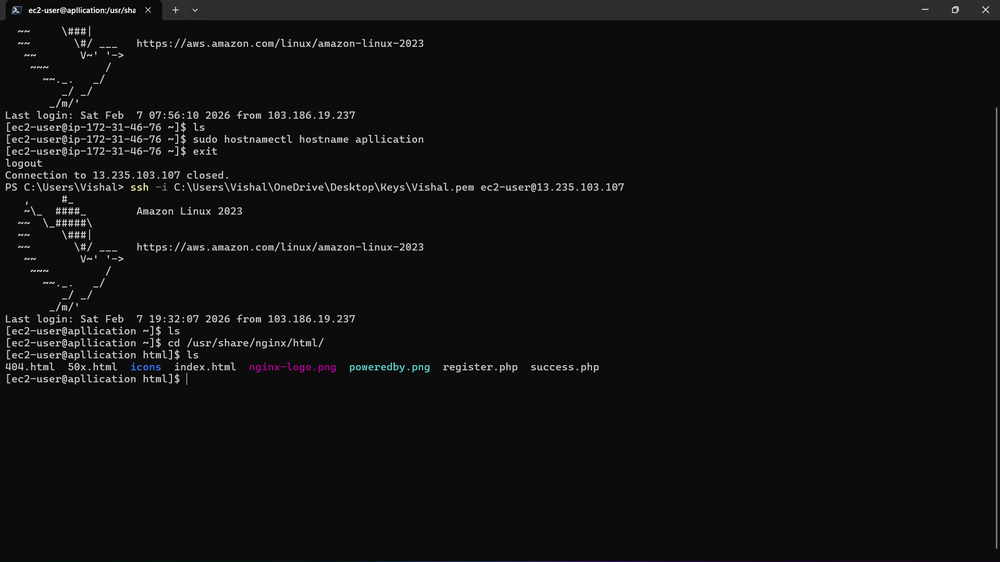
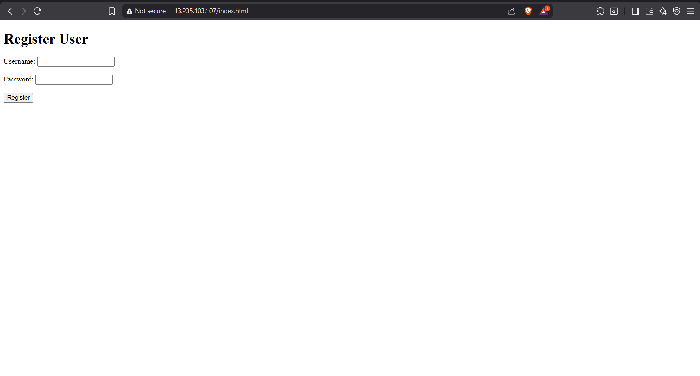
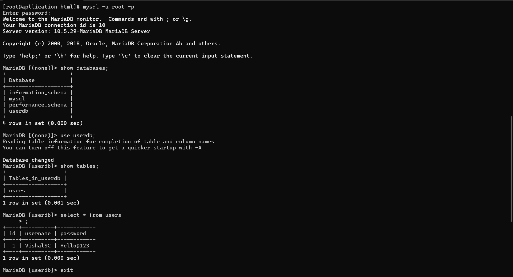

# AWS EC2 Deployment – Application 🖥️

## 📌 Task Overview

This task demonstrates deploying a **simple frontend + backend application** on **AWS EC2**, connected to a **MySQL (MariaDB) database**.  
The goal is to ensure the application connects successfully to the database and provides a working interface.

---

## 🛠️ Task Requirements

The following objectives were completed:

- Create a **simple frontend + backend app**
- Use **one database (MySQL/MariaDB)**
- Ensure the app connects to the database successfully
- Verify application functionality via browser

---

## 🖥️ Infrastructure Details

- **Cloud Provider:** AWS
- **Service:** EC2
- **Instance Type:** t2.micro
- **OS:** Amazon Linux 2023
- **Region:** ap-south-1 (Mumbai)
- **Web Server:** NGINX
- **Database:** MySQL (MariaDB)
- **Application Type:** PHP + HTML frontend with MySQL backend

---

## 📷 Screenshots Reference

| Image   | Description |
|---------|-------------|
| `t24.png` | AWS EC2 Instances dashboard showing Task-6 running |
| `t25.png` | EC2 terminal setup, hostname change, and NGINX HTML directory contents |
| `t26.png` | Frontend application (Register User form) |
| `t27.png` | MySQL database connection and query results |

---

## 📸 Screenshots

### EC2 Instances Dashboard

### EC2 Terminal & NGINX Setup

### Frontend Application – Register User

### MySQL Database Connection

---

## 📦 Application Details

### Frontend
- Simple HTML form for **user registration**
- Fields: **Username** and **Password**
- Submits data to backend (PHP)

### Backend
- PHP scripts handle form submission
- Connects to **MySQL database**
- Stores user credentials in `users` table

### Database
- **Database Name:** `userdb`
- **Table:** `users`
- **Columns:** `id`, `username`, `password`
- Example entry:
