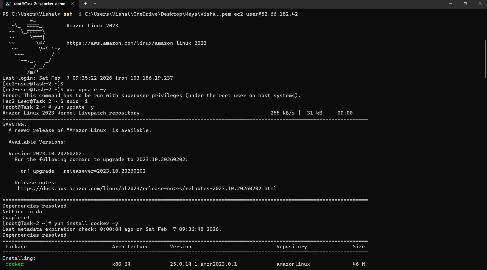
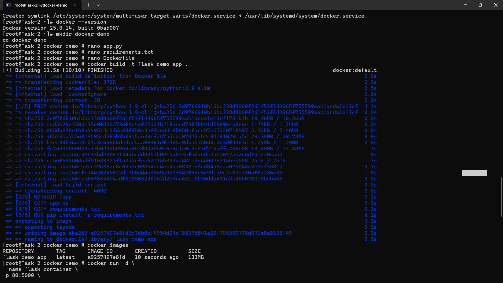

# Docker Setup and Application Deployment

## Step 1: Create Dockerfile
A Dockerfile was created inside the project directory. It defines the base image, copies the application files, installs dependencies, and sets the working directory. This ensures the Flask application can be containerized consistently.

  
This image shows the EC2 instance setup and monitoring details before Docker installation. It confirms the environment where Docker will be deployed.

---

## Step 2: Install and Configure Docker
Docker was installed on the Amazon Linux 2023 instance. The installation was verified with the `docker --version` command. A directory named docker-demo was created, and files such as app.py, requirements.txt, and Dockerfile were added.

  
This image shows the terminal output during Docker installation and the creation of the project files.

---

## Step 3: Build Docker Image
The Docker image was built using the command `docker build -t flask-demo-app .`. The build process pulled the Python 3.9 slim image, copied the application files, and installed dependencies. The resulting image was tagged as flask-demo-app.

  
This image shows the Docker build process and the successful creation of the flask-demo-app image.

---

## Step 4: Run Application in Docker Container
The container was started with the command:

