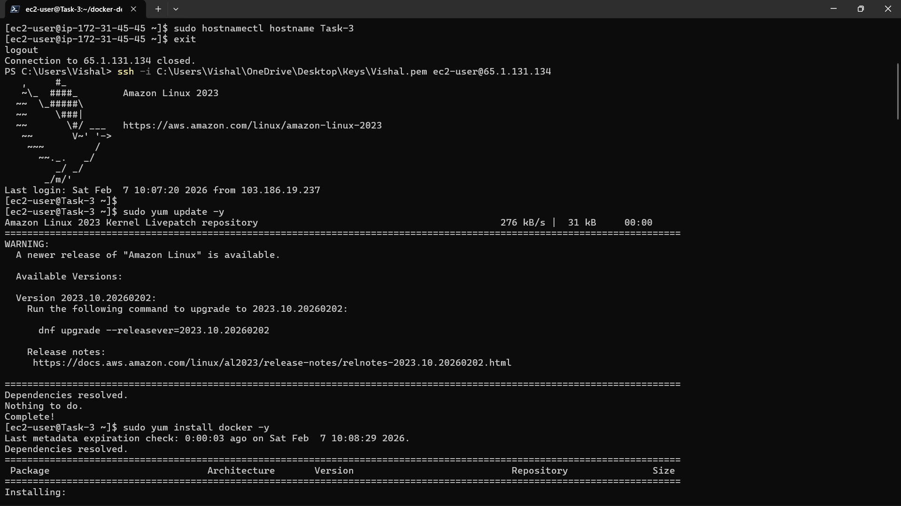
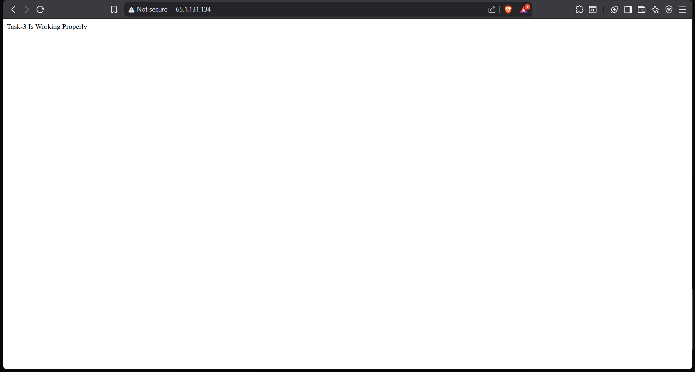

# AWS EC2 Deployment

## Task Overview

This task demonstrates deploying a Flask application on an AWS EC2 instance using Docker.  
It covers launching EC2, installing Docker, running containers, exposing ports, and verifying application output.

---

## Task Requirements

The following objectives were completed:

- Launch EC2 instance (cost-optimized: t2.micro / t3.micro)
- Install Docker on EC2
- Build Docker image
- Run application inside Docker container
- Expose required ports
- Ensure container auto-starts on reboot

---

## Infrastructure Details

- Cloud Provider: AWS
- Service: EC2
- Instance Type: t2.micro
- OS: Amazon Linux 2023
- Region: ap-south-1 (Mumbai)
- Application Type: Python Flask App
- Container Platform: Docker

---

## Screenshots Reference

| Image   | Description |
|---------|-------------|
| `t1.png` | AWS EC2 Instances dashboard showing running/stopped states |
| `t2.png` | EC2 terminal setup & Docker installation |
| `t3.png` | Docker image build process for Flask app |
| `t4.png` | Running Docker container details |
| `t5.png` | Flask app output in browser |

---

## Screenshots

### EC2 Instances Dashboard


### Docker Installation on EC2


### Docker Image Build


### Docker Container Running


### Flask Application Output


---

## Dockerfile

The Dockerfile used to containerize the Flask application:

```dockerfile
FROM python:3.9-slim

WORKDIR /app

COPY app.py .
COPY requirements.txt .

RUN pip install -r requirements.txt

EXPOSE 5000

CMD ["python", "app.py"]
