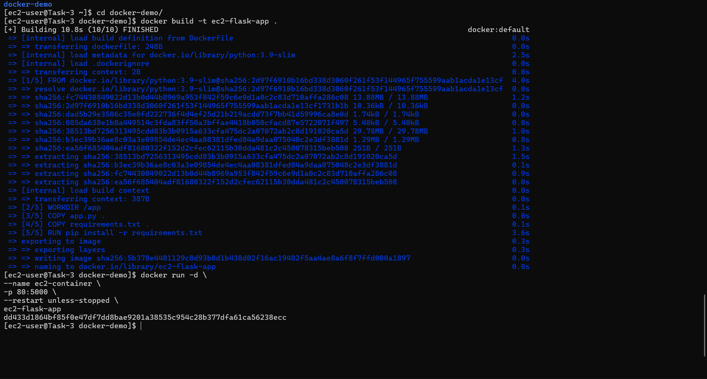

# Docker Task – EC2 Flask Application Deployment

## 📌 Task Overview

This task demonstrates how to containerize an application using **Docker**, run it inside Docker containers on an **AWS EC2 instance**, expose required ports, and ensure the container **auto-starts on system reboot**.

---

## 🛠️ Task Requirements

The following objectives were completed:

- Create Dockerfile(s)
- Build Docker image
- Run application using Docker containers
- Expose required ports
- Ensure Docker containers auto-start on reboot

---

## 🖥️ Infrastructure Details

- **Cloud Provider:** AWS
- **Service:** EC2
- **Instance Type:** t2.micro
- **OS:** Amazon Linux 2023
- **Region:** ap-south-1 (Mumbai)
- **Application Type:** Python Flask App
- **Container Platform:** Docker

---

## 📷 Screenshots Reference

| Image | Description |
|------|------------|
| `t6.png` | AWS EC2 Instances running state |
| `t7.png` | EC2 terminal setup & Docker installation |
| `t8.png` | Docker image build process |
| `t9.png` | Running Docker container |

---

## 📸 Screenshots

### EC2 Instances Overview


### Docker Installation on EC2


### Docker Image Build


### Docker Container Running


---

## 📦 Dockerfile

The Dockerfile was created to containerize a Flask application:

```dockerfile
FROM python:3.9-slim

WORKDIR /app

COPY app.py .
COPY requirements.txt .

RUN pip install -r requirements.txt

EXPOSE 5000

CMD ["python", "app.py"]
