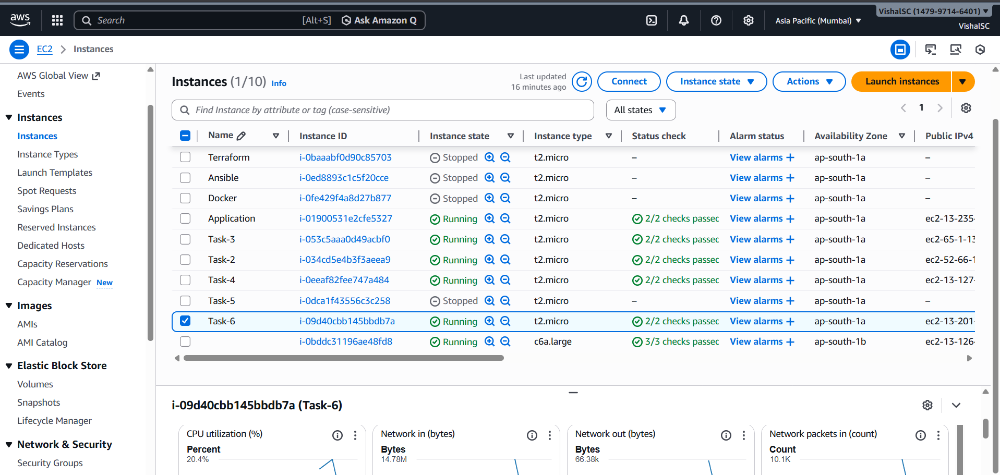

# Task-3: Docker Implementation on AWS EC2

## Objective
The objective of this task is to containerize a Flask application using Docker, deploy it on an AWS EC2 instance, expose the required ports, and ensure that the Docker container automatically starts on system reboot.

---

## Technologies Used
- AWS EC2 (Amazon Linux 2023)
- Docker
- Python (Flask)
- GitHub

---

## Task Requirements
- Create Docker file(s)
- Run application using Docker containers
- Expose required ports
- Ensure containers auto-start on reboot

---

## EC2 Instance Setup
An EC2 instance was launched in the **Asia Pacific (Mumbai)** region. The instance was accessed using SSH and prepared for Docker deployment.

### EC2 Instances Overview


**Image Info:**  
`t6.png` shows the AWS EC2 dashboard with running and stopped instances used during this task.

---

## Docker Installation
Docker was installed and enabled on the EC2 instance using Amazon Linux 2023 package manager.

```bash
sudo yum update -y
sudo yum install docker -y
sudo systemctl start docker
sudo systemctl enable docker
