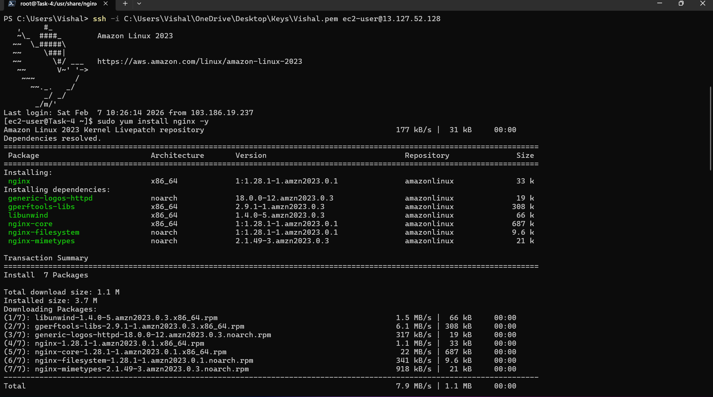
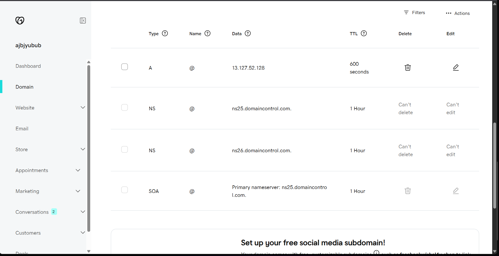
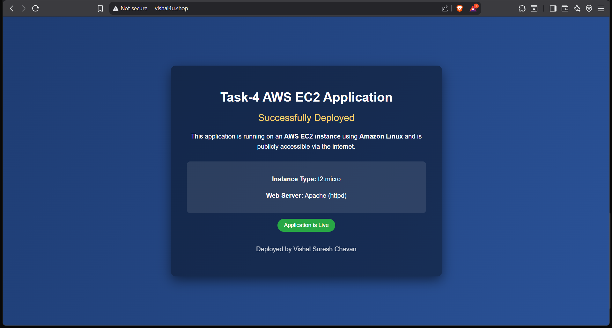

# Task-4 – Application Access

## Task Overview

This task shows how a web application deployed on AWS EC2 can be accessed using:
- Elastic IP
- EC2 Public IP
- Custom domain using GoDaddy (vishal4u.shop)

---

## Task Objectives

The following tasks were completed successfully:

- Elastic IP was associated with the EC2 instance
- Application was accessed using EC2 Public IP
- DNS records were configured in GoDaddy
- Application was accessed using custom domain vishal4u.shop

---

## Infrastructure Details

- **Cloud Provider:** AWS
- **Service:** EC2
- **Instance Type:** t2.micro
- **Operating System:** Amazon Linux 2023
- **Region:** ap-south-1 (Mumbai)
- **Application Type:** Web Application (Flask / NGINX / Apache)
- **Domain Provider:** GoDaddy

---

## Screenshots Description

| Image   | Description |
|--------|-------------|
| t10.png | EC2 dashboard showing running instance |
| t11.png | EC2 terminal and NGINX installation |
| t12.png | NGINX configuration and service running |
| t13.png | GoDaddy DNS records mapped to Elastic IP |
| t14.png | Application live using custom domain |

---

## Screenshots

### EC2 Instances Dashboard

### NGINX Installation on EC2

### NGINX Configuration

### GoDaddy DNS Setup

### Application Live via Domain

---

## Application Access

The application can be accessed using:

- **Elastic IP:** 13.127.52.128
- **EC2 Public IP:** 65.1.131.134
- **Custom Domain:** http://vishal4u.shop

---

## Result

The application was successfully deployed on AWS EC2 and can be accessed using:
- Elastic IP
- EC2 Public IP
- Custom Domain

The browser displays the message:

**"Task-4 AWS EC2 Application – Successfully Deployed"**
