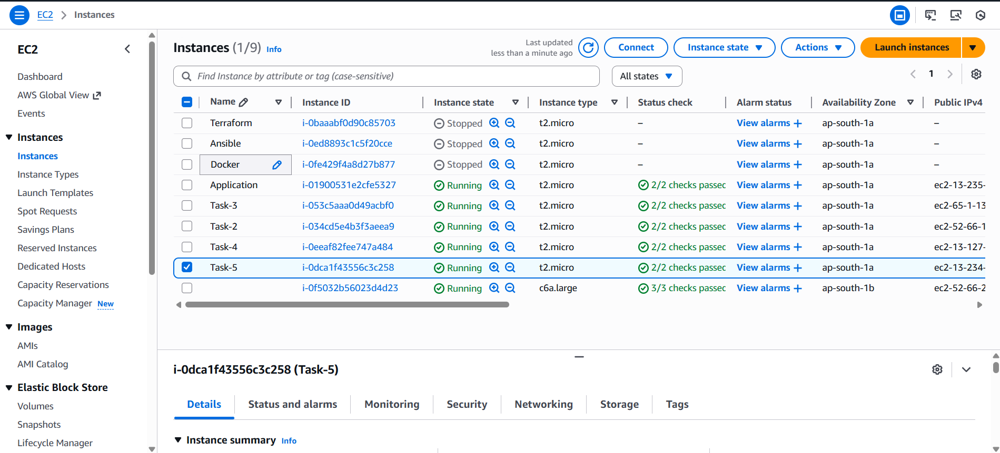
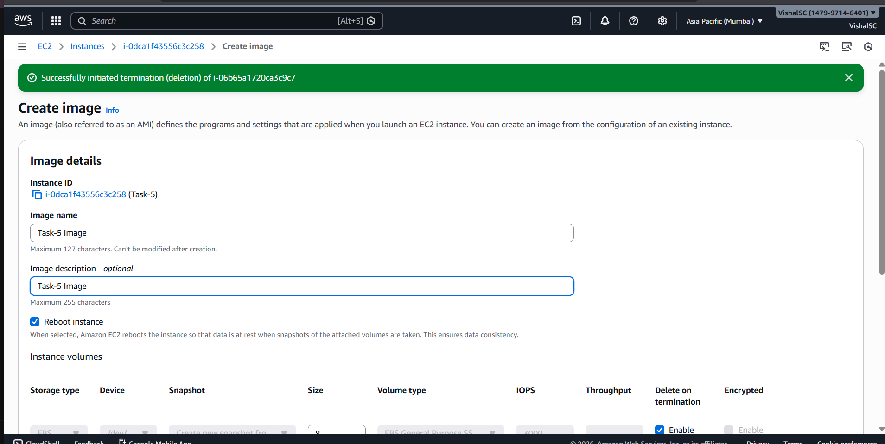
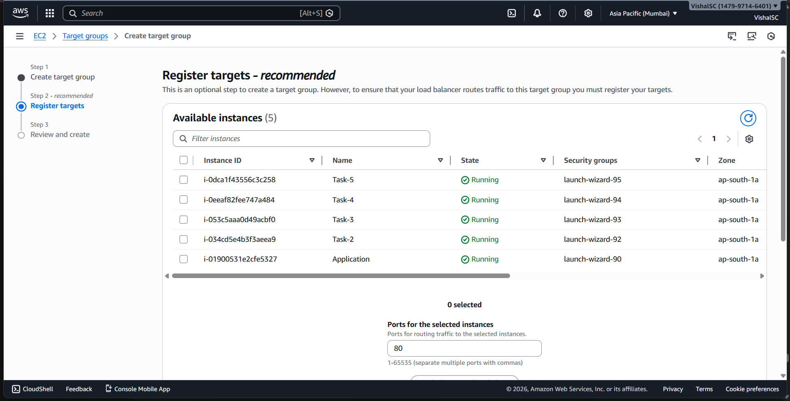
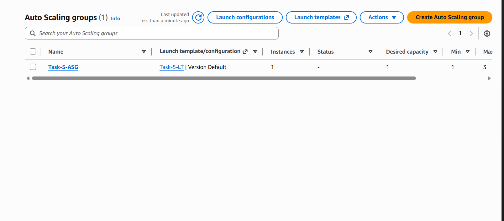
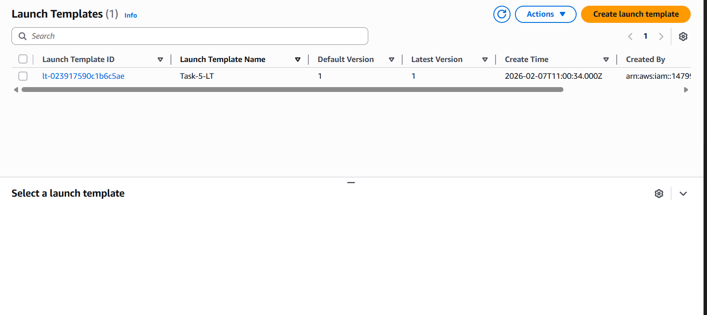
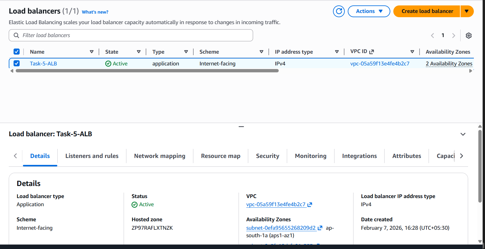
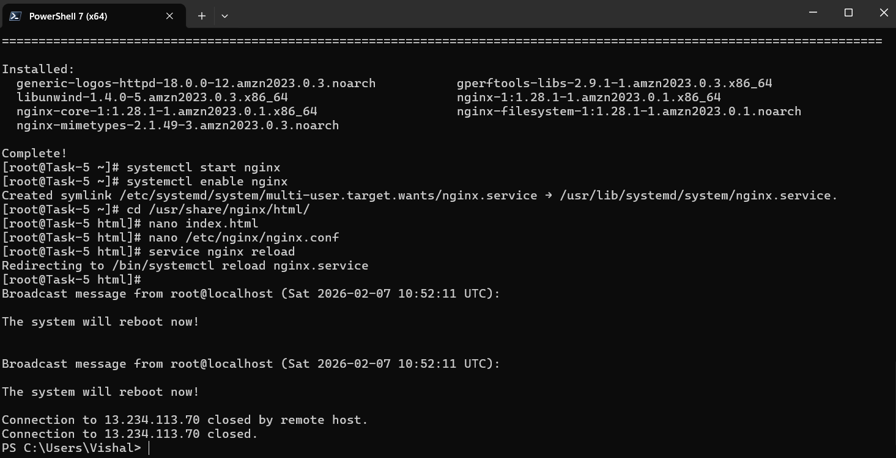
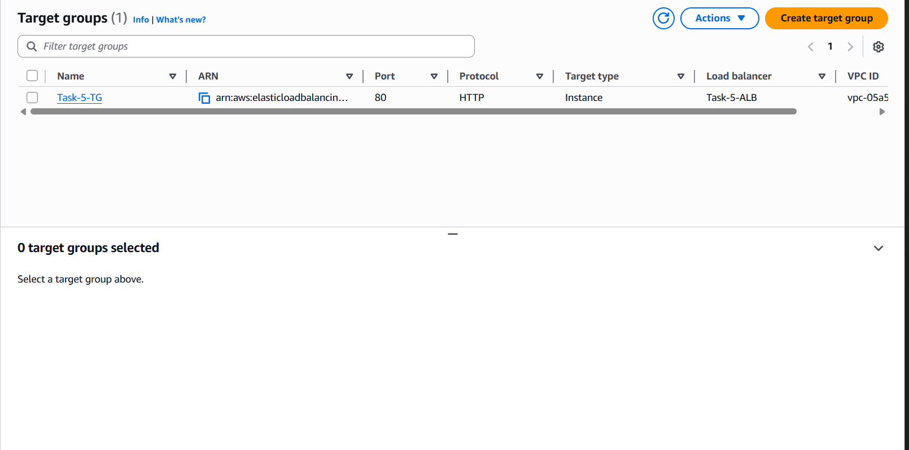
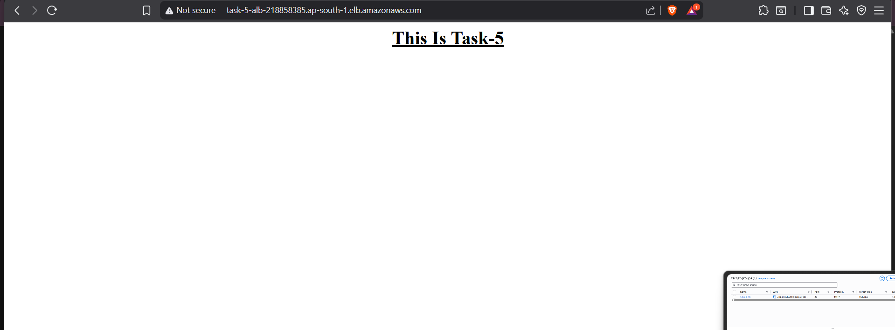

# Task -5 Load Balancer and Auto Scaling

## Task Overview

This task explains how an Application Load Balancer (ALB) and Auto Scaling Group (ASG) were configured in AWS.  
The setup automatically increases or decreases EC2 instances based on CPU usage.

---

## Requirements Completed

The following tasks were completed successfully:

- Application Load Balancer (ALB) was configured
- Auto Scaling Group (ASG) was attached to the load balancer
- Scaling policies were set based on CPU utilization
- Load balancing and auto scaling were tested and verified

---

## Infrastructure Details

- **Cloud Provider:** AWS
- **Services Used:** EC2, Application Load Balancer, Auto Scaling
- **Instance Type:** t2.micro
- **Operating System:** Amazon Linux 2023
- **Region:** ap-south-1 (Mumbai)
- **Scaling Metric:** CPU Utilization
- **Load Balancer Type:** Application Load Balancer (ALB)

---

## Screenshots Description

| Image | Description |
|------|-------------|
| t15.png | EC2 dashboard showing Task-5 instances |
| t16.png | Creating AMI from Task-5 EC2 instance |
| t17.png | Registering EC2 instances to target group |
| t18.png | Auto Scaling Group configuration |
| t19.png | Launch template used for Auto Scaling |
| t20.png | Application Load Balancer setup |
| t21.png | NGINX installation and configuration |
| t22.png | Target group linked with ALB |
| t23.png | Application running live through ALB |

---

## Screenshots

### EC2 Instances Dashboard

### Creating AMI from Instance

### Registering Instances to Target Group

### Auto Scaling Group Configuration

### Launch Template for Auto Scaling

### Application Load Balancer Configuration

### NGINX Installation and Configuration

### Target Group Details

### Application Live via ALB

---

## Scaling Policy Details

- **Metric Used:** CPU Utilization
- **Scale Out Condition:** CPU usage greater than 70%
- **Desired Capacity:** 1 instance
- **Minimum Instances:** 1
- **Maximum Instances:** 3
- **Scaling Action:** New EC2 instances are launched automatically using the launch template when CPU threshold is crossed

---

## Result

The application was successfully deployed using:

- Application Load Balancer to distribute traffic
- Auto Scaling Group to manage EC2 instances
- CPU-based scaling policy for automatic scaling

The browser confirmed the application is live with the message:

**"This Is Task-5"**
